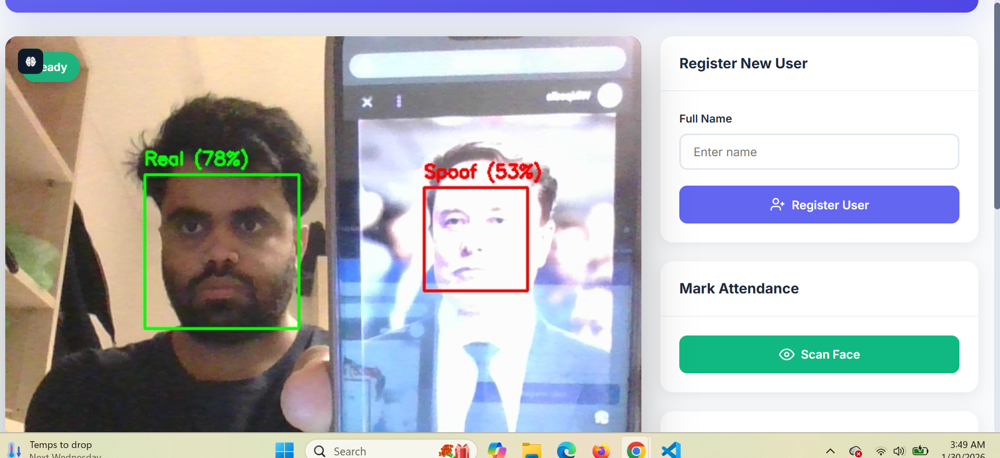

# Face Recognition + Anti-Spoofing Attendance System

A real-time biometric attendance system built with Python and Flask. It combines face detection, face recognition, and a fully self-implemented classical-CV anti-spoofing module to reject photo and screen-replay attacks.

## Demo



## Features

- Real-time face detection via MediaPipe BlazeFace
- Face recognition using DeepFace / FaceNet embeddings (cosine similarity)
- Anti-spoofing with 7 hand-crafted classical CV detectors — no pre-trained spoof model required
- Web interface for user registration, attendance marking, and log viewing
- Attendance log persisted to JSON

## Anti-Spoofing Approach

The anti-spoofing module (`anti_spoof.py`) is entirely self-implemented. It combines two independent score tracks:

**Screen / replay attack track**
| Detector | Physical basis |
|---|---|
| Rolling-shutter banding | Screens flicker at a fixed refresh rate, causing horizontal intensity bands |
| Emission + uniformity | Screens emit light; real faces only reflect it, producing higher brightness variance |
| Screen colour saturation | LCD backlights produce skin tones with higher HSV saturation and a blue bias compared to real skin |
| Optical-flow liveness | Real faces show non-rigid micro-motion; flat objects translate rigidly |
| Moiré / FFT | Screen pixel grids create periodic frequency peaks detectable via FFT |

**Print attack track**
| Detector | Physical basis |
|---|---|
| LBP texture entropy | Real skin at close range has rich micro-texture (entropy > 1.8); prints and screens compress it |
| Temporal colour variation | Blood flow causes subtle R/G channel variation across frames; printed faces are static |
| Edge sharpness anomaly | JPEG and print compression leaves characteristic edge artefacts |

Scores are fused as `spoof_score = max(screen_score, print_score)` and compared to a threshold of 0.35. A face is classified as a bona fide presentation if `spoof_score < 0.35`.

## Installation

Requires Python 3.10 or 3.11.

```bash
# Create and activate a virtual environment
python -m venv venv
venv\Scripts\activate          # Windows
# source venv/bin/activate     # Linux / macOS

# Install dependencies
pip install -r requirements.txt
```

The MediaPipe BlazeFace model (`blaze_face_short_range.tflite`) is downloaded automatically on first run.

## Running

```bash
python app.py
```

Open [http://localhost:5000](http://localhost:5000) in your browser.

## Usage

1. **Register** — enter a name and click "Register User". Stand in front of the camera alone.
2. **Mark Attendance** — click "Scan Face". The system will detect, anti-spoof-check, and recognise you.
3. **Attendance Log** — visible in the right panel; also saved to `data/attendance_log.json`.

The anti-spoofing overlay shows a green bounding box (Real) or red (Spoof) on the live feed at all times.

## Project Structure

```
├── app.py                  Flask application and REST endpoints
├── anti_spoof.py           Self-implemented classical CV anti-spoofing
├── anti_spoof_classical.py Earlier version kept for reference
├── face_detector.py        MediaPipe BlazeFace wrapper
├── face_recognizer.py      DeepFace / FaceNet wrapper
├── setup_antispoof.py      Utility to download MiniFASNet weights (not used by default)
├── requirements.txt
├── templates/
│   └── index.html
├── static/
│   ├── css/style.css
│   └── js/main.js
├── data/                   Created at runtime (user DB + attendance log)
└── demo/
    └── demo.png
```

## Configuration

The anti-spoofing threshold can be adjusted in `anti_spoof.py`:

```python
# Line ~130 in predict()
is_real = spoof_score < 0.35   # lower = stricter (fewer false accepts)
```

The face recognition similarity threshold is set in `face_recognizer.py`:

```python
def __init__(self, db_path="data/users.pkl", threshold=0.6):
```

## Troubleshooting

**Real face flagged as spoof**
- Improve lighting — the emission and colour detectors are sensitive to low-light conditions
- Raise the threshold slightly (e.g. `0.38`)

**Photo / screen accepted as real**
- Lower the threshold (e.g. `0.30`)
- Make sure anti-spoofing is enabled in the UI (toggle switch)

**Camera not detected**
- The app tries index 1 (external webcam) before index 0 (built-in). Check that your webcam is connected before starting.

## Dependencies

| Package | Purpose | Source |
|---|---|---|
| flask | Web server | External |
| opencv-python | Image processing, optical flow | External |
| mediapipe | Face detection (BlazeFace) | External (Google) |
| deepface | Face recognition (FaceNet) | External |
| scikit-image | LBP feature extraction | External |
| numpy | Numerical operations, FFT | External |
| scikit-learn | Cosine similarity | External |
